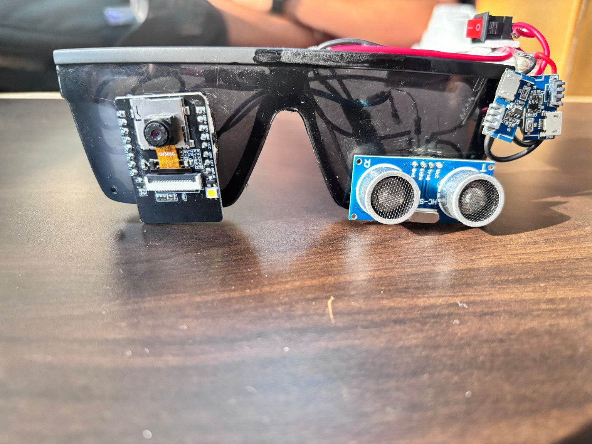

# DRUSHTI 👓

## Obstacle Detection Glasses for the Blind

DRUSHTI is a wearable assistive technology project designed to help visually impaired people detect obstacles and improve their mobility.

The project uses an ESP32-CAM and ultrasonic sensing to detect obstacles and provide audio alerts to the user.

---

## 📌 Project Overview

DRUSHTI is designed in the form of smart glasses to provide a hands-free obstacle detection solution for visually impaired people.

The device is mounted on a spectacle frame and integrates sensing, processing, audio feedback and portable power components.

The ultrasonic sensor measures the distance of nearby obstacles. The ESP32-CAM acts as the main processing and sensing unit. When an obstacle is detected within the defined range, the system provides an audio alert to the user.

---

## 🎯 Problem Statement

Visually impaired people can face difficulties while detecting obstacles during walking and navigation.

Traditional mobility aids may not provide sufficient awareness of every obstacle, especially in different environments.

DRUSHTI aims to provide an affordable and wearable solution that can detect nearby obstacles and alert the user through audio feedback.

---

## 💡 Objectives

The main objectives of DRUSHTI are:

- To develop a wearable obstacle detection system.
- To help visually impaired people detect nearby obstacles.
- To provide real-time audio alerts.
- To create a compact and hands-free assistive device.
- To develop an affordable solution for safer mobility.

---

## ⚙️ System Overview

The main components used in the DRUSHTI prototype are:

- ESP32-CAM
- Ultrasonic Sensor
- Li-ion Battery
- Buck Converter
- Audio Earpiece
- Spectacle Frame

---

## 🔧 Hardware Components

| Component | Purpose |
|---|---|
| ESP32-CAM | Main controller and camera-based sensing |
| Ultrasonic Sensor | Measures distance to nearby obstacles |
| Li-ion Battery | Provides portable power |
| Buck Converter | Regulates the required voltage |
| Audio Earpiece | Provides audio feedback |
| Spectacle Frame | Provides the wearable structure |

---

## 🔄 Working Principle

The system works through the following process:

1. The device is powered using a rechargeable Li-ion battery.
2. The ESP32-CAM and ultrasonic sensor are activated.
3. The ultrasonic sensor measures the distance of nearby obstacles.
4. The measured distance is checked against a predefined detection range.
5. If an obstacle is detected within the required range, the system generates an alert.
6. The alert is provided to the user through the audio earpiece.
7. The user can respond to the obstacle while moving.

### Working Flow

```text
        ┌─────────────────┐
        │   ESP32-CAM     │
        │ Sensing System  │
        └────────┬────────┘
                 ↓
        ┌─────────────────┐
        │   Ultrasonic    │
        │     Sensor      │
        └────────┬────────┘
                 ↓
        ┌─────────────────┐
        │    Distance     │
        │   Measurement   │
        └────────┬────────┘
                 ↓
        ┌─────────────────┐
        │    Obstacle     │
        │    Detected?    │
        └────────┬────────┘
                 ↓
        ┌─────────────────┐
        │   Audio Alert   │
        └────────┬────────┘
                 ↓
        ┌─────────────────┐
        │      User       │
        └─────────────────┘


        ## 📸 Project Gallery

### Project View


### Front View


### Prototype


### Side View

